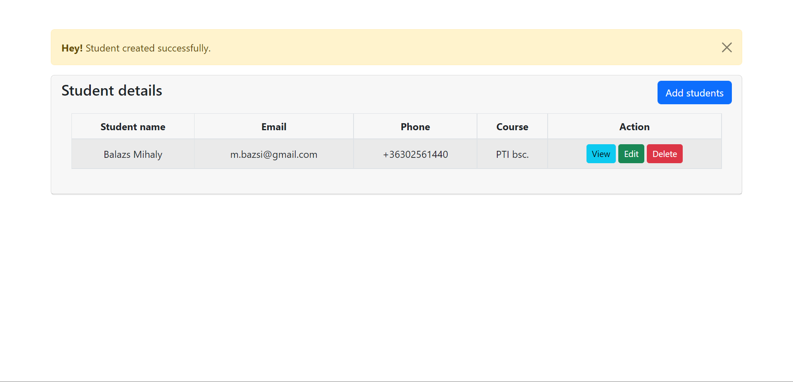
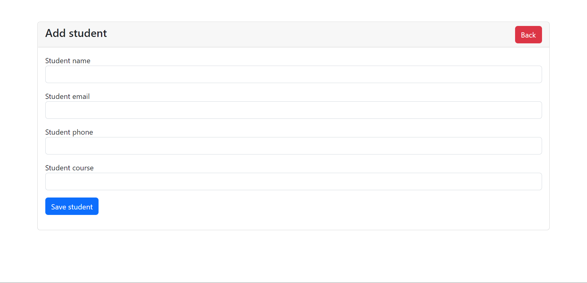

# Funkcionális specifikáció

## 1. Jelenlegi helyzet leírása

Jelenleg az iskolában azt, hogy kinek mi az adata, csak papír alapon tartották nyílván. A papír alapú módszer, működik, de eléggé lassú, emberi hibából adódóan a félreértések esélye jelentős. A megírt lapok elveszhetnek, szennyeződhetnek, az emberi írás mások számára olvashatatlan lehet. Az emberek jelenleg csak úgy tudnak tájékozódni mások adatairól, ha személyesen bemennek az iskolába. Ezt a plusz utat szeretné a megrendelő kikerülni, azzal, hogy online elérhetővé teszi azon adatokat melyeket publikusak mindenki számára. A megrendelő szereti a modern dolgokat, többek között is ezért is gondolta úgy, hogy itt az ideje elkészíteni az alkalmazást.

## 2. Vágyállomrendszer leírása

A megrendelő egy olyan alkalmazást szeretne ami, segítené az ő ügyfeleit abban, hogy elérjék a tanulók adatait anélkül, hogy a mappákba lefűzött papírokat kelljen átvizsgálni, ezzel biztosítani a rugalmasságot, gyorsaságot. A szoftvert kezdetleges állapotában is fel kell készíteni a későbbi fejleszthetőségre, ami az első használat utáni visszajelzések fényében valúsulhat meg. A már felvett tanulók listázása mellett e megrendelő szeretné, ha gyorsan, egyszerűen lehetne diákokat hozzáadni az adatbázishoz, abban az esetben, valamint a meglévő adatokat tudja módosítani, szükség esetén eltávolítani a listából. Egy egyszerűen átlátható programot kért, mert fontos számára, hogy egyértelműek legyenek a gombok, a mezők, mit, hova kell beírni. Nem szeretne több munkanapot eltölteni azzal, hogy megtanulja használni a szoftvert. A szoftvernek készen kell állnia arra, hogy bővíthető legyen, egyéb funkciókkal, a későbbiekben elképzelhető, hogy a megrendelő szeretne regisztrálási lehetőséget, a rendszeresen tőle bérlőknek kedvezményeket nyújtani, ezeket nyilvántartani. A megrendelő továbbá azt szeretné, hogy az alkalmazás alkalmazkodjon az adott eszközön lévő kijelző méretéhez, vagyis reszponzív legyen a felület!

## 3. Jelenlegi üzleti folyamatok modellje

A jelenlegi rendszerben az megrendelőnek be kell menni az egyetem titkárságára, minden adatot innen tud megszerezni. Itt kell eligazodni a több évtizednyi lefűzött irat között, ami hosszú időt vesz igénybe, illetve pontatlansághoz vezethet. Az adatfeltöltés is manuálisan történik, az ottdolgozók az írott lapokról egyesével viszik be az adatokat a rendszerbe.

## 4. Igényelt üzleti folyamatok modellje

A megrendelő otthon, vagy akár a buszon ülve is képes információt szerezni a diákokról. Bárhonnan hozzá tud adni új diákokat, módosíthatja a már meglévő adatokat, illetve szükség esetén törölhet is az adatbázisból, ezzel gyorsítva az információ áramlását, hiszen nem kell megvárni az adatrögzítők munkáját, hanem azonnal a friss, naprakész listával dolgozhat mindenki.

## 5. Követelménylista

| Id | Modul | Név | Leírás |
| :---: | --- | --- | --- |
| K1 | Felület | Tanuló hozzáadása | Tanulót tudunk felvinni az adazbázisba |
| K2 | Felület | Tanuló szerkesztése | Tanuló adatait tudjuk megváltoztatni az adazbázisba |
| K3 | Felület | Tanuló törlése | Tanulót tudunk törölni az adazbázisból |
| K4 | Felület | Tanuló adatainak áttekintése | Egy keresett tanuló adatát tudjuk megtekinteni |

## 6. Használati esetek
A tanár a diákról tárol az alkalmazásban adatokat, szerkeszti, új diákot visz fel, már nem az adott iskolában lévő diákot töröl az adatbázisból! A diák ezeket az adatokat ellenörzi az adatbázisban és jogosult az adatmódosításra, ha változás, vagy hibás adat felvitele történt! 

## 7. Megfeleltetés, hogyan fedik le a használati eseteket a követelményeket
K1, K2, K3, K4: A felhasználó gombok segítségével tud adatokat módositani, felvinni, törölni és megtekinteni!
## 8. Képernyőtervek

**Főoldal/Tanulók listázása**

**Új tanuló hozzáadása az adatbázishoz**

## 9. Forgatókönyvek

Szeptember van és jönnek az új diákok. A szülő segítségével felviszik a szükséges adatokat, Így megspórolva a felesleges papírpocsékolást.
Az admin ezeket módosítani és újabb adatokkal is tudja bővíteni az adatbázist. Bárhol is legyen, akár az iskolában, akár otthon.

## 10. Funkció - követelmény megfeleltetése

K1: A felhasználók a weblapon a "Add Students" gombra kattintva a diák adatait (név, email, telefonszám, szak) megadva felveheti a listába.
K2: A felhasználók a weblapon a "Edit" gombra kattintva módosíthatja az adatokat (név, email, telefonszám, szak).
K3: A weblapon szereplő "Delete" gombbal a diák minden adatát, illetve a diák mezőjét is törölhetik.
K4: A "View" gomb megnyomásával a diák adatai válnak áttekinthetővé. Ebben a funkcióban nem lehet sem szerkeszteni, sem törölni.

## 11 Fogalomszótár
| Fogalom | Leírás |
| :---: | --- |
| Reszponzív felület | Az alkalmazás kompatibilis más elektronikus eszközökön is, így lehet használni számítógépről, tabletről, laptopról és telefonról is, mert alkalmazkodik az eszköz kijelzőjéhez! |
| UML | Unified Modeling Language |
